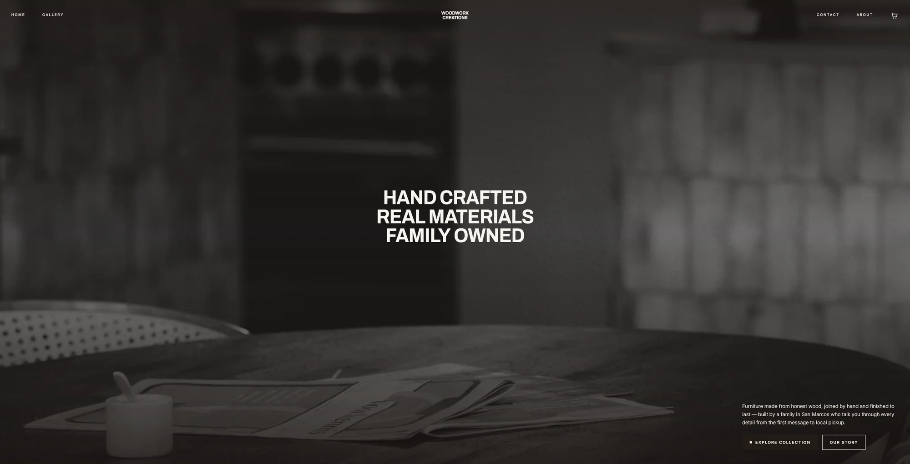
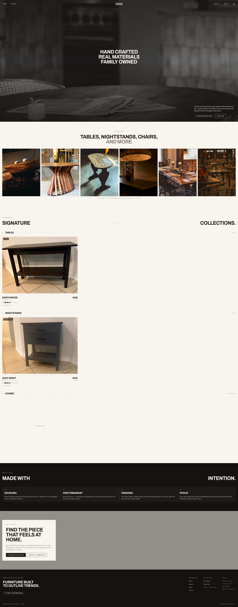

# WoodWork Creations

A storefront for a family-owned carpentry business. Browse handmade furniture, pick a finish, leave a review with photos, and check out through Stripe.

**Live:** [woodwork-creations.com](https://woodwork-creations.com/) · **Preview:** [carpentry-website-two.vercel.app](https://carpentry-website-two.vercel.app/)

See the full home page

**Stack:** React 19 · React Router 7 · TypeScript · Tailwind v4 · Express · MongoDB (Mongoose) · Node on Vercel · Stripe Checkout · Vercel Blob

My first full-stack MERN project, and my first time using MongoDB, Express, and Node on something real rather than in a tutorial. Everything before this was frontend-only. It sells to a local community: pieces are hand-built and made to order, with local pickup only. That constraint shaped most of what follows.

---

## Design decisions

**The catalog is a TypeScript file, not a database table.** `src/utility/catalog.ts` exports a typed `Product[]`, and every product surface derives from it: the home grid, the detail page, the cart line, the Stripe line item, and the MongoDB query key. MongoDB stores *only* reviews.

The catalog is small today and intended to grow. At its current size, moving it into Mongo would buy an admin panel I'd have to build and a loading state on the most important content on the site, in exchange for editing convenience I don't need yet. Keeping it in TypeScript means the compiler catches a typo in a product route at build time instead of at a 404. The tradeoff is real and it has an expiry date: prices and copy require a deploy to change, so once the catalog is large enough that I'm editing it regularly, or the owner wants to change a price without me, it belongs in the database.

**One dynamic endpoint instead of per-product routes.** Each product carries a `reviewDB` key, and both review endpoints are parameterised on it: `/api/reviews/:productKey`. One collection serves the whole catalog and one handler serves every product. The catalog file, the URL parameter, and the database query key are the same string travelling through React state, an HTTP route, and a Mongo index without ever being retyped. This was the moment MERN clicked for me.

**Cart state lives in `App.tsx`.** It began inside a single product page, which worked until the cart had to be visible from the nav on every route. Lifting `useState` above `<Routes>` gave the drawer and every product page a common parent. No Redux, no Context, because it's one array with one writer.

**Hosted Stripe checkout, not a custom form.** Card details never touch my server, my database, or my code. For a solo project handling real money for a real family business, that wasn't a close call.

**A connection guard for serverless.** On Vercel the Express app is a serverless function, so calling `mongoose.connect()` per request exhausts the Atlas pool. Checking `readyState` before connecting, as middleware, was the fix. Traditional Express tutorials connect once at startup because there *is* a startup.

---

## Challenges faced

**Deploying a frontend and backend as one Vercel project.** `vercel.json` runs two builds from one repo, with rewrites sending `/api/*` to Express and everything else to `index.html` so client-side routing survives a refresh. That last rewrite took several attempts. Before it, deep-linking to `/about` returned a 404 from the CDN, because no such file exists.

**Serverless changed how I had to write the backend.** No startup, no shared memory, no disk. Nearly everything I'd read about Express assumed a long-lived process.

**Cart identity across finishes.** The same table in espresso and in olive are different line items, but incrementing one shouldn't touch the other. A composite key, `` `${product.id}-${finalColor}` ``, fixed it. Several commits are me chasing bugs where the colour string didn't match between the cart, the conditional rendering, and the Stripe line item, because one path prefixed it and another didn't.

**Autoplaying video on mobile.** iOS Safari's autoplay policy, a `useEffect` that didn't help, and the file size all conspired against the hero video. It's a still image now, and the site is faster for it.

**Accessibility retrofitting.** Icon-only buttons with no accessible name, labels not tied to their inputs, a disabled button that was still keyboard-reachable because it used `pointer-events-none` instead of the `disabled` attribute. Lighthouse found most of it; adopting React Aria Components prevented the next round.

---

## What I learned, and what I want to improve

**Building the backend teaches you what the frontend was hiding.** Every prior project ended at the network boundary. Owning both sides meant learning that a schema is a contract two codebases have to agree on, that the shape of a URL is a design decision, and that "it works locally" and "it works deployed" are separate claims.

**Conditional rendering is where the bugs live.** Nearly every rendering bug I chased came down to two branches disagreeing about a string's format. Deriving values from one source instead of rebuilding them in three places is a lesson I paid for in commits.

**Trusting the client is the default mistake.** The browser code and the server code were both mine, so it didn't occur to me that the boundary between them is where someone else's input arrives. That instinct produced most of what the security review later found.

**Accessibility is cheaper to design in than to retrofit.** I did it the expensive way here.

What I'd do differently next time:

- **Design the routing before writing the pages.** I added routes one at a time as pages appeared, which left me with a hand-written file per product and a second one per review, each differing from the next by a single string. A single `/product/:productId` route reading `useParams` would have replaced all of them, and choosing that on day one would have cost nothing. Retrofitting it now means touching every catalog file.

- **Decide how shared components sit on the page before styling them.** The cart drawer and the nav render on every route, and I positioned them with `clamp()` in the CSS. That held at the resolutions I tested and distorted between them, so the cart ended up vertically offset on catalog pages at mobile widths while looking correct everywhere else. I fixed it per page, which multiplied the problem into a different top margin on every route. One shared layout variable that every page pads against, which is what the site uses now, was the right answer from the start.

- **Settle the API's shape before building against it.** I designed the review endpoints midway through, once reviews became the first thing that couldn't be hardcoded, and by then several components were already fetching in their own way. Fixing that meant editing multiple files to agree on one key. Deciding the route shape and the response contract up front is far cheaper than reconciling them later.

- **Real error and loading states.** Most failure paths still end at `console.error`, so a visitor on a slow connection sees an unresponsive button with no explanation.

- **Stripe webhooks and order records.** Nothing listens for `checkout.session.completed`, so orders exist only in the Stripe dashboard and the app itself has no record that a purchase happened.

---

## What AI tooling helped with

**Google Gemini, while building it.** This was my first backend, and Gemini is how I learned to write one. It walked me through standing up a server and connecting it to MongoDB, then helped me refine the endpoints, get to grips with React Router, and work out the add-to-cart flow. The 219 commits that took this from an empty repository to a deployed site are hand-written, but that guidance is what got me unstuck along the way.

Once the site was live, I used [Claude Code](https://claude.com/claude-code) for three follow-up passes, each on a branch and merged by pull request:

**A visual overhaul.** The original design worked but was inconsistent: spacing set per page, and a few colour tokens referenced in class names that were never defined, so those swatches rendered transparent. This rebuilt the design system with real colour ramps, a type scale, a single `--header-h` every page pads against, and reusable component classes. Routes, catalog data, and checkout logic were deliberately untouched, because keeping the diff to styling is what made it reviewable.

**A code-organisation pass.** Duplicated markup collapsed into data-driven components; the FAQ went from ten `useState` calls and five copies of the same markup to one array mapped over. Dead tokens, unused CSS, and leftover `console.log` calls came out.

**A security review before making the repository public.** This was the valuable one. It found three things: checkout built its Stripe line items from the request body, so a crafted request could set its own price; reviewer emails were being served publicly on every product page; and the review endpoint was unauthenticated, unthrottled, and accepted 50 MB uploads. All three are fixed, and the fixes were verified by replaying the attacks against a local instance.

A dozen small commits after each pass are me reviewing the output and correcting it. The tool did the sweep; the judgement calls about what the site should say and look like stayed mine.

**Obsidian for project memory.** A new AI session starts with no memory of the last one, so I keep a vault of linked notes documenting the architecture, the conventions, and the known tech debt. Pointing a fresh session at the relevant notes means it starts with the context I already have, instead of inferring conventions from whichever files it happened to read first. It turned out to be just as useful to me. The tech debt note is where half the improvements above came from, and I'd forgotten several of them. That's the habit I'd carry into the next project regardless of tooling: documentation that explains *why*, kept close enough to the code that it actually gets updated.

---

Built by [Joshua M.](https://github.com/JoshuaM04)
