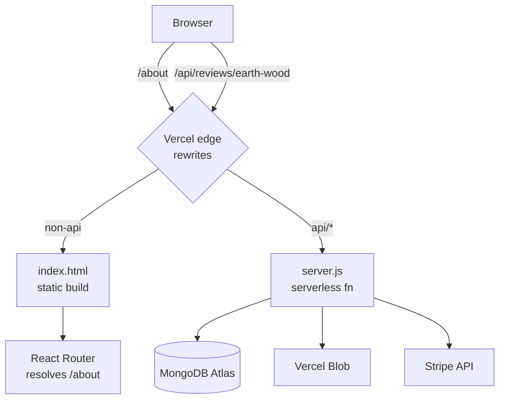
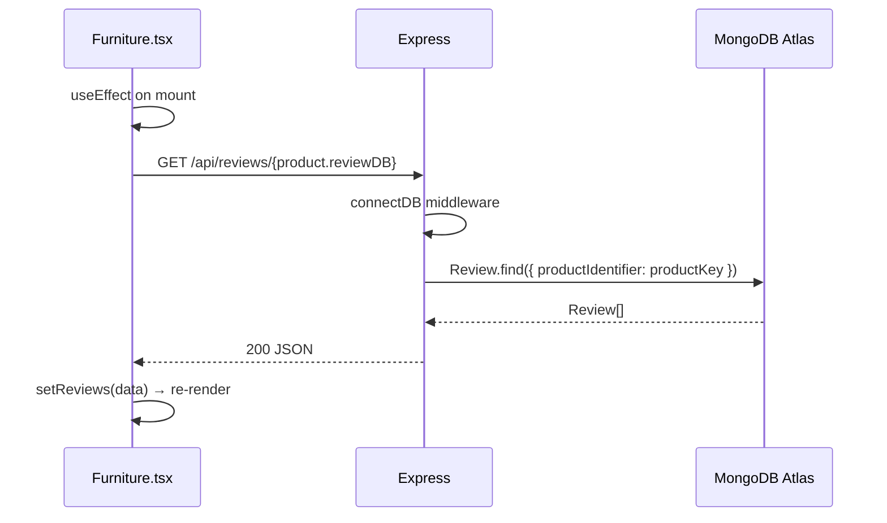
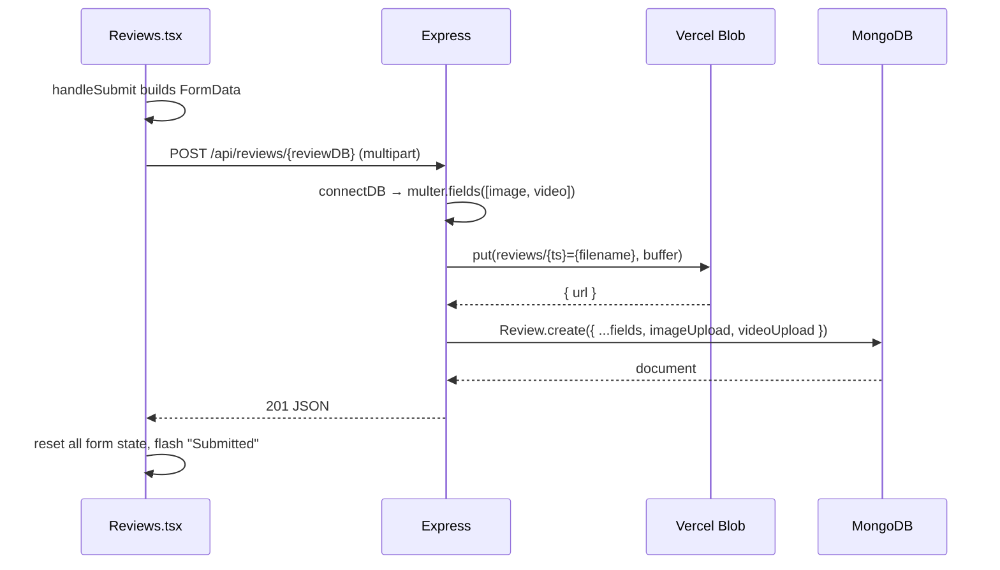
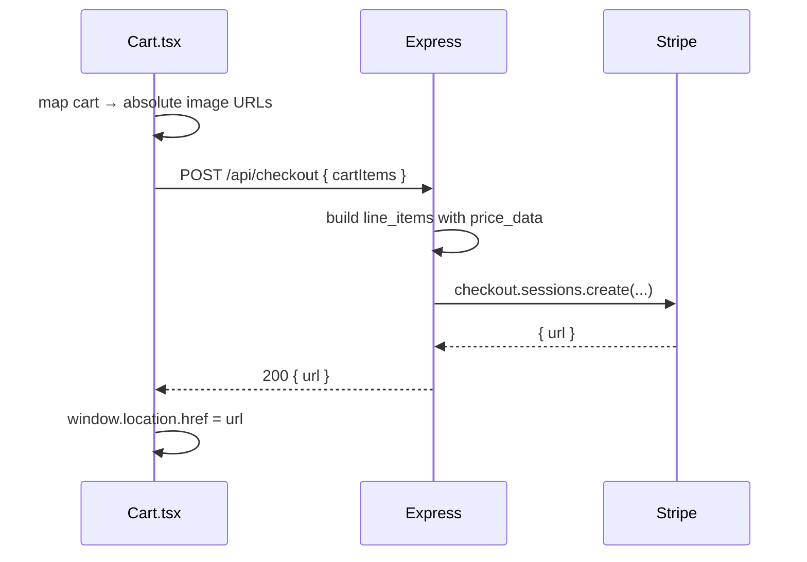

# 01 — Architecture and Data Flow

How the MERN pieces actually connect in this repo, and what happens on each of the three round-trips the app makes.

Related: [[06 - Backend API]] · [[07 - MongoDB and Mongoose]] · [[13 - Deployment and Configuration]]

---

## The unusual part: one repo, two Vercel builds

`vercel.json` declares **two independent builds from a single repository**:

```json
"builds": [
  { "src": "package.json",          "use": "@vercel/static-build" },
  { "src": "backend/src/server.js", "use": "@vercel/node" }
]
```

- The **frontend** is compiled by Vite into static assets.
- The **backend** is *not* a long-running server. `server.js` ends with `export default app` — Vercel wraps the Express app as a serverless function handler. The `app.listen(8080)` call is guarded:

```js
if (process.env.NODE_ENV !== 'production') {
    app.listen(8080, () => console.log("Server running on port 8080"));
}
```

So the same file is a real server locally and a stateless function in production. This single fact explains the connection-caching guard in [[07 - MongoDB and Mongoose]].

## Routing: rewrites decide who handles a URL

```json
"rewrites": [
  { "source": "/api/checkout",            "destination": "/backend/src/server.js" },
  { "source": "/api/reviews",             "destination": "/backend/src/server.js" },
  { "source": "/api/reviews/:productKey", "destination": "/backend/src/server.js" },
  { "source": "/((?!api/).*)",            "destination": "/index.html" }
]
```

The last rule is the SPA catch-all: *anything not starting with `api/` returns `index.html`*, letting React Router own client-side history. Without it, a hard refresh on `/about` would 404.

Because the API is served from the **same origin** as the app, the frontend uses bare relative paths (`fetch('/api/reviews/earth-wood')`) and CORS is never actually exercised in production.



---

## Lifecycle 1 — Reading reviews

Triggered on mount by both [[03 - Component Network|FurnitureCard]] (home grid) and `Furniture` (detail page).



The join key is `product.reviewDB` from [[05 - Catalog Data Model]] matched against `productIdentifier` in the Mongo document. That string is the *entire* relationship between the hardcoded catalog and the database.

`FurnitureCard` performs the same fetch but only to compute an average:

```ts
const totalRatingSum = data.reduce((sum, review) => sum + review.rating, 0);
const averageRating  = totalRatingSum / data.length;
```

## Lifecycle 2 — Writing a review



Note the form is `multipart/form-data`, not JSON — because files ride along. This is why `Reviews.tsx` builds a `FormData` and passes **no** `Content-Type` header (the browser must set the multipart boundary itself). Details in [[09 - Media Uploads]].

## Lifecycle 3 — Checkout



Prices are **not** read from Stripe. `stripePriceId` in the catalog is literally `'N/A'`; the server constructs `price_data` inline from `item.price`. See [[08 - Stripe Checkout Flow]] for the implication.

---

## State ownership, in one line

Cart state lives in `App.tsx` (the router's parent) because two sibling subtrees need it: the **product pages** write to it and the **`Cart` modal** reads it. See [[04 - State Management Patterns]].

## What is *not* in this architecture

- No global state library (no Redux/Zustand/Context) — props only
- No data-fetching library (no React Query/SWR) — raw `fetch` in `useEffect`
- No auth, sessions, or user accounts
- No server-side rendering — pure client-side SPA
- No products collection in MongoDB
- No test suite

These are deliberate scope choices for a small storefront, but each is a fork in the road if the app grows. See [[15 - Known Gotchas and Tech Debt]].
