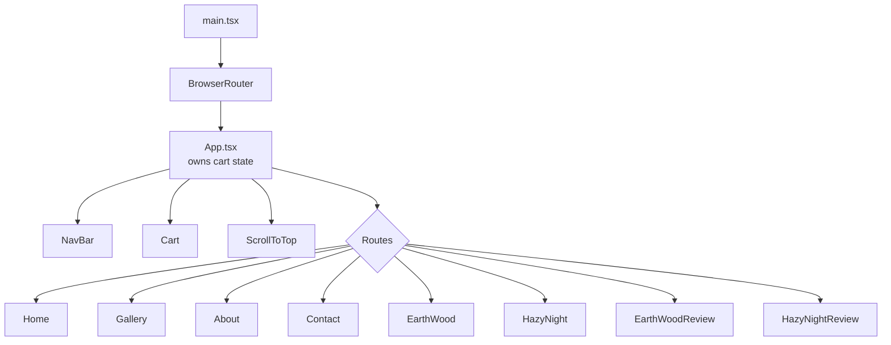

# 02 — Frontend Routing

Related: [[03 - Component Network]] · [[04 - State Management Patterns]] · [[05 - Catalog Data Model]]

---

## The bootstrap chain

`index.html` → `src/main.tsx` → `src/App.tsx`

```tsx
// main.tsx — 13 lines, does exactly three things
createRoot(document.getElementById('root')!).render(
  <StrictMode>
    <BrowserRouter>
      <App />
    </BrowserRouter>
  </StrictMode>,
)
```

1. **`StrictMode`** — double-invokes effects in development. Relevant: every `useEffect` fetch in this app fires twice locally. Harmless for GETs, but worth knowing when reading the console.
2. **`BrowserRouter`** — history-API routing (clean URLs, no `#`). Requires the SPA rewrite in `vercel.json`; see [[01 - Architecture and Data Flow]].
3. **`import './App.css'`** — this is where Tailwind enters the bundle. See [[10 - Tailwind Design System]].

Note the non-null assertion `getElementById('root')!` — a deliberate escape hatch, since `index.html` guarantees the node exists.

## The route table

`App.tsx` is the shell: it renders persistent chrome, then the route outlet.

```tsx
<div className="root-container min-h-dvh font-roboto">
  <Analytics />        {/* Vercel — no visual output */}
  <SpeedInsights />    {/* Vercel — no visual output */}
  <NavBar />           {/* persistent across all routes */}
  <Cart cart={cart} setCart={setCart} />
  <ScrollToTop />      {/* returns null; side-effect only */}

  <Routes> ... </Routes>
</div>
```

| Path | Element | Props | Notes |
|---|---|---|---|
| `/` | `<Home />` | — | |
| `/home` | `<Home />` | — | duplicate alias of `/` |
| `/gallery` | `<Gallery />` | — | placeholder "Coming Soon" |
| `/about` | `<About />` | — | |
| `/contact` | `<Contact />` | — | |
| `/EarthWood` | `<EarthWood />` | `addToCart` | product detail |
| `/HazyNight` | `<HazyNight />` | `addToCart` | product detail |
| `/EarthWoodReview` | `<EarthWoodReview />` | — | review form |
| `/HazyNightReview` | `<HazyNightReview />` | — | review form |

### Routing observations

**Routes are PascalCase and per-product.** `/EarthWood`, not `/products/earth-wood`. Every new product therefore requires: a new file, a new import, and a new `<Route>`. There is no `:productId` param route. See [[14 - Adding a New Product]] and the refactor note in [[15 - Known Gotchas and Tech Debt]].

**Route strings are stored in the catalog, not hardcoded in links.** This is the good half of the design — `catalog.ts` holds `route: '/EarthWood'` and `review: '/EarthWoodReview'`, so link targets stay in sync:

```tsx
<Link to={product.route}>      // FurnitureCard.tsx
<Link to={product.review}>     // Furniture.tsx
```

**No 404 route.** An unmatched path renders the chrome (nav + cart) with an empty content area rather than a not-found page.

**`Cart` is mounted outside `<Routes>`** so its modal state and the cart badge survive navigation.

## `ScrollToTop` — the null-rendering component

```tsx
export default function ScrollToTop() {
    const { pathname } = useLocation();
    useEffect(() => { window.scrollTo(0, 0); }, [pathname]);
    return null;
}
```

A pure side-effect component. `BrowserRouter` preserves scroll position on navigation, which feels broken when jumping from a long home page to a product page. Subscribing to `pathname` and resetting scroll fixes it declaratively — no imperative call needed at any link site. This is the idiomatic React Router solution and the cleanest piece of code in the repo.

## Layout responsibility is per-page, not shared

There is **no shared layout route**. Each page renders its own `<Footer />` and its own top spacing:

```tsx
// Home.tsx, Gallery.tsx, About.tsx, Contact.tsx, EarthWood.tsx, ...
<div className="...-container flex flex-col gap-20">
    <main>...</main>
    <Footer />
</div>
```

Consequence: the fixed navigation bar is compensated for with **manual top margins that differ per page** — `mt-30`, `mt-40`, `mt-60`, `mt-80`. Covered in [[11 - Styling Conventions]].


