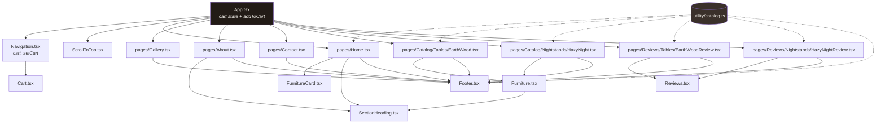

# 03 — Component Network

Why each component exists, what it receives, and how the pieces compose.

Related: [[02 - Frontend Routing]] · [[04 - State Management Patterns]] · [[05 - Catalog Data Model]]

---

## The full tree



Dotted lines are **data imports**, solid lines are **renders**.

Two structural changes from the original tree: `Cart` now hangs off `Navigation` rather than `App`, and `Footer` reads the catalog directly. Both are explained below.

---

## The organizing principle

The split between `components/` and `pages/` is not by size or complexity — it's by **who supplies the data**:

- **`pages/`** — route targets. They *look up* their own product from `FURNITURE_CATALOG` and frame the shared component.
- **`components/`** — receive everything through props. With one exception (`Footer`), they never import the catalog array, only its `Product` *type*.

`Furniture.tsx` is 250 lines and `EarthWood.tsx` is 25 — yet `Furniture` is a component and `EarthWood` is a page. The size is irrelevant; the data ownership is the rule.

## The thin-page / fat-component pattern

This is the most important structural idea in the frontend. Every product page is a near-identical 25-line adapter:

```tsx
// pages/Catalog/Tables/EarthWood.tsx
export default function EarthWood({ addToCart }: EarthWoodProps) {
    const item = FURNITURE_CATALOG.find((product) => product.id === 'earth-wood')

    if (!item) return <p className="p-6">Product not found</p>;

    return (
        <div className="table-one-container flex flex-col min-h-dvh w-full">
            <Furniture product={item} addToCart={addToCart} />
            <Footer />
        </div>
    );
}
```

`HazyNight.tsx` is byte-for-byte identical except the `id` string and the semantic container name. The page's entire job is:

1. **Bind** a hardcoded `id` to a catalog entry
2. **Guard** against a missing entry (`if (!item) return ...`)
3. **Pass through** `addToCart` from `App`
4. **Stack** the shared component above a footer

All product behaviour — gallery, finish picker, add-to-cart, review list — lives once in `Furniture.tsx`.

The pages got *thinner* during the visual overhaul. They used to carry the page's spacing too (`gap-20 p-10 w-fit max-2md:max-w-full`, plus an `mt-80` deep inside `Furniture`); now the shared component owns its own gutters and its own `pt-(--header-h)`, so the page contributes nothing but a flex column. See [[11 - Styling Conventions]].

The review pages do the same thing with a different idiom — `.filter().map()` over a single-element array instead of `.find()`:

```tsx
// pages/Reviews/Tables/EarthWoodReview.tsx
FURNITURE_CATALOG.filter((item) => item.id === 'earth-wood').map((item) => (
    <Reviews key={item.id} product={item} />
))
```

Functionally equivalent to `.find()`, but it sidesteps the null check because an empty array simply renders nothing. Two idioms for the same job — noted in [[12 - Coding Style Guide]].

---

## Component reference

### `Navigation.tsx` — fixed header, dual layout, cart host
**Props:** `{ cart: any[], setCart: React.Dispatch<React.SetStateAction<any[]>> }` — declared as `React.ComponentProps<typeof Cart>`, so the shape is derived from `Cart` rather than restated.

The header is `fixed` at `h-(--header-h)` with `z-30`. It renders **two complete markup trees** and toggles them with breakpoint utilities:

```tsx
<div className="desktop-layout ... max-2md:hidden">
<div className="mobile-layout  ... 2md:hidden">
```

Both map over one `LINKS` array and share a `brand` element defined once as a local variable, so the duplication is structural rather than textual.

Desktop is a `justify-between` row with the wordmark absolutely centred between two link pairs and the cart at the right. Mobile is the wordmark, the cart, and a React Aria `DialogTrigger` → full-screen `Modal` menu, where each link is wrapped in `<Button slot="close">` so tapping it dismisses the overlay.

**It hosts the cart.** `App` passes `cart` and `setCart` straight through, and `Navigation` renders `<Cart />` inside both trees:

```tsx
<div className="flex items-center gap-12">
    {LINKS.slice(2).map(...)}
    <Cart cart={cart} setCart={setCart} />
</div>
```

This is what let `Cart` drop its route-dependent absolute positioning — the trigger is now a normal flex child of the header row.

**Two pieces of state drive the chrome:**

```tsx
const isHomePage = location.pathname === '/' || location.pathname === '/home';
const isTransparent = isHomePage && !scrolled;
```

```tsx
className={`${isTransparent
    ? 'bg-transparent border-transparent'
    : 'bg-bark-900/95 border-bone-50/10 backdrop-blur-sm'} ... transition-colors duration-500`}
```

The bar is transparent over the home hero and solid everywhere else, including on the home page once you scroll past 40px. The listener is registered `{ passive: true }` and calls `onScroll()` once on mount so a page restored mid-scroll starts in the right state.

The hover underline that used to be a four-element string array is gone — it is now the `.link-underline` class, pure CSS. See [[10 - Tailwind Design System]].

### `Cart.tsx` — drawer, quantities, checkout
**Props:** `{ cart: any[], setCart: React.Dispatch<React.SetStateAction<any[]>> }`

Three responsibilities:
- **Badge** — `cart.reduce((total, item) => total + item.quantity, 0)`, hidden when empty, positioned against the trigger button rather than the page
- **Quantity control** — `updateQuantity(cartItemId, ±1)` maps over the cart and **filters out anything that hits zero**, so decrementing to 0 removes the line item. There is no separate delete button; this is the removal mechanism.
- **Checkout** — normalises image paths to absolute URLs, POSTs to `/api/checkout`, redirects. See [[08 - Stripe Checkout Flow]].

The panel is a right-hand drawer on `lg` and a full-screen sheet below it, split into three padded blocks — header, scrolling item list, totals — rather than one padded parent with negative-margin dividers.

The stain swatch on each line is looked up from a literal map instead of being built from a template string:

```tsx
const SWATCH_STYLES: Record<string, string> = {
    'raw wood': 'bg-raw-500', 'espresso': 'bg-espresso-500',
    'olive': 'bg-olive-500',  'gray': 'bg-gray-500'
};
```

The old `` `bg-${item.activeColor}-500` `` never reached the stylesheet — Tailwind cannot evaluate a template literal. See [[05 - Catalog Data Model]].

Gone with the overhaul: the `useLocation` import and the `isHomePage ? 'absolute top-[110%] p-10' : 'absolute ... mt-[8rem] p-10'` spacing switch. The component no longer knows what route it is on.

### `SectionHeading.tsx` — the split display heading
**Props:** `{ eyebrow?: string, left: string, right?: string, inverted?: boolean }`

The smallest component in the repo and the most reused piece of layout. It renders the `LEFT ——— RIGHT.` heading that opens every section:

```tsx
<SectionHeading eyebrow="Available now" left="Signature" right="Collections." />
<SectionHeading eyebrow="How it is made" left="Made with" right="Intention." inverted />
```

An optional kicker above, then the two halves pushed apart by a `flex-1` spacer containing a short centred rule. `inverted` switches the eyebrow from `text-stone-500` to `text-clay-400` for dark bands — the only prop that exists purely for contrast. Below `xsm` the halves stack and the rule is hidden.

Used by `Home` (three times), `About` (four), and `Furniture` (once).

### `FurnitureCard.tsx` — catalog tile
**Props:** `{ product: Product }`

Rendered by `Home` in a `.filter().map()` per category. The whole tile is one `<Link to={product.route}>`, so the image, the name, the swatch row, and the price are a single click target — and hovering anywhere on it scales the photograph, via the `a:hover .img-frame img` rule.

Fetches reviews solely to display an average rating, with a `!product?.reviewDB` early return and `[product?.reviewDB]` as the dependency.

The empty state is now a single expression rather than two always-mounted nodes toggled by class:

```tsx
<p className="micro text-stone-500">
    {data.length === 0
        ? 'No reviews yet'
        : `${averageRating.toFixed(1)} / 5.0 · ${data.length} review${data.length === 1 ? '' : 's'}`}
</p>
```

`colorTextStyles` is no longer read here — the swatch labels moved to `sr-only` text, so only the background class is needed.

### `Furniture.tsx` — the product detail engine (~250 lines)
**Props:** `{ product: Product, addToCart: (product, selectedColor) => void }`

The largest component. Five concerns in one file:

1. **Breadcrumb** — `Catalog / <type>s / <name>`, the only breadcrumb in the app.

2. **Image gallery** — the images in an `overflow-hidden` row, translated by a CSS custom property:
   ```tsx
   style={{'--animation-duration': `0.7s`, '--galleryPosition': `${activeButton}`} as React.CSSProperties}
   ```
   The transform lives in `App.css` under `.animated-gallery`. Both the slides and the controls now map over `product.imageGallery`, so the gallery adapts to any number of images — the hardcoded `galleryPosition = [0, 1, 2]` and `galleryButton = [0, 1, 2]` arrays are gone, as is the assumption of exactly three views. The dots are bars, with an `01 / 03` counter beside them.

3. **Spec table** — `width`, `height`, `diameter`, `wood`, and a static completion estimate, as label/value rows separated by hairlines rather than `<hr />`.

4. **Finish selection** — `colors[]` and `colorStyles[]` iterated by shared index, each a `<button>` with the swatch above its label. Add-to-cart is genuinely disabled until a finish is chosen:
   ```tsx
   <button onClick={...} disabled={activeColor === ''} className="btn btn-solid justify-center w-full">
       {activeColor === '' ? 'Select a finish first' : 'Add to cart'}
   </button>
   ```
   The `disabled` attribute replaced `pointer-events-none`, which left the control reachable by keyboard, and the label now states the precondition instead of leaving a dead button.

5. **Review list** — fetches on mount, renders stars as filled/unfilled `★` spans, and picks a media layout with two independent truthiness checks rather than a three-level nested ternary.

### `Reviews.tsx` — review submission form (~250 lines)
**Props:** `{ product: Product }`

A controlled form: one `useState` per field, plus `activeRating`, plus separate display-name and `File` state for each upload. Star rating is five `<button type="button">` elements (explicit `type` so they don't submit the form) filling `fill-bark-900` when `activeRating >= item`, with a `3 / 5` readout beside them.

File inputs are visually hidden and driven by their labels — the standard accessible custom-file-input pattern, with the label styled as a button:

```tsx
<label htmlFor="imgUpload" className="btn btn-ghost">Upload image</label>
<input id="imgUpload" type="file" accept="image/*" onChange={handleImage} className="hidden" />
```

Filenames longer than 20 characters are truncated for display while the real `File` is kept in separate state. The clear buttons now carry `type="button"` and reset **both** pieces of state:

```tsx
onClick={() => { setImageUpload('No file chosen'); setSelectedImageFile(null); }}
```

Previously they cleared only the display name — so a "cleared" file still uploaded — and, lacking a `type`, submitted the form on click.

### `Footer.tsx` — the one component that reads the catalog
No props, no state, but no longer trivial. Four columns: a statement with a contact CTA, an information column, a **collection column derived from `FURNITURE_CATALOG`**, and a studio column of plain facts. A hairline row underneath carries the copyright and the byline.

```tsx
{
    FURNITURE_CATALOG.map((item) => (
        <Link key={item.id} to={item.route} className="link-underline w-fit">{item.name}</Link>
    ))
}
```

This is the single exception to the dependency rule below, and it is deliberate: a footer that lists products from the same source the rest of the app uses cannot drift out of date when a product is added. The alternative — threading a `products` prop through six pages to reach a footer — buys nothing.

Imported by six files.

---

## Dependency direction

```
pages ──imports──> components ──imports──> utility/catalog (type only)
  │                     │
  │                     └── Footer.tsx ──imports──> utility/catalog (data)
  └──imports──> utility/catalog (data + type)
```

No component imports a page. Only `Footer` imports `FURNITURE_CATALOG` as data. This near-one-way flow is what makes `Furniture` and `Reviews` reusable for every future product without modification.

## Third-party components

Both modals import from a **subpath**:

```tsx
import { DialogTrigger, Modal, Dialog, Heading, Button } from 'react-aria-components/Modal';
```

React Aria supplies focus trapping, `Escape` to dismiss, scroll locking, and ARIA wiring. The `slot="close"` prop on a `<Button>` closes the enclosing dialog with no state plumbing — which is why neither `Cart` nor `Navigation` has an `isOpen` state variable.

Every interactive icon-only control carries an explicit label: `aria-label="Cart modal display"`, `aria-label="Open drop-down menu navigation"`, `aria-label={`Show image ${index + 1}`}`, `aria-label={isOpen ? 'Collapse answer' : 'Expand answer'}`.
