# 03 — Component Network

Why each component exists, what it receives, and how the pieces compose.

Related: [[02 - Frontend Routing]] · [[04 - State Management Patterns]] · [[05 - Catalog Data Model]]

---

## The full tree

```mermaid
flowchart TD
    App[App.tsx<br/><i>cart state + addToCart</i>]

    App --> Nav[Navigation.tsx]
    App --> Cart[Cart.tsx]
    App --> STT[ScrollToTop.tsx]

    App --> Home[pages/Home.tsx]
    App --> Gallery[pages/Gallery.tsx]
    App --> About[pages/About.tsx]
    App --> Contact[pages/Contact.tsx]
    App --> EW[pages/Catalog/Tables/EarthWood.tsx]
    App --> HN[pages/Catalog/Nightstands/HazyNight.tsx]
    App --> EWR[pages/Reviews/Tables/EarthWoodReview.tsx]
    App --> HNR[pages/Reviews/Nightstands/HazyNightReview.tsx]

    Home --> FC[FurnitureCard.tsx]
    Home --> F1[Footer.tsx]
    Gallery --> F1
    About --> F1
    Contact --> F1

    EW --> Furn[Furniture.tsx]
    HN --> Furn
    EW --> F1
    HN --> F1

    EWR --> Rev[Reviews.tsx]
    HNR --> Rev
    EWR --> F1
    HNR --> F1

    Cat[(utility/catalog.ts)] -.-> Home
    Cat -.-> EW
    Cat -.-> HN
    Cat -.-> EWR
    Cat -.-> HNR

    style App fill:#572a00,color:#fff
    style Cat fill:#333,color:#fff
```



Dotted lines are **data imports**, solid lines are **renders**.

---

## The organizing principle

The split between `components/` and `pages/` is not by size or complexity — it's by **who supplies the data**:

- **`pages/`** — route targets. They *look up* their own product from `FURNITURE_CATALOG` and own page layout (spacing, `<Footer />`).
- **`components/`** — receive everything through props. They never import the catalog array, only its `Product` *type*.

`Furniture.tsx` is 207 lines and `EarthWood.tsx` is 26 — yet `Furniture` is a component and `EarthWood` is a page. The size is irrelevant; the data ownership is the rule.

## The thin-page / fat-component pattern

This is the most important structural idea in the frontend. Every product page is a near-identical 26-line adapter:

```tsx
// pages/Catalog/Tables/EarthWood.tsx
export default function EarthWood({ addToCart }: EarthWoodProps) {
    const item = FURNITURE_CATALOG.find((product) => product.id === 'earth-wood')

    if (!item) return <p>Product not found</p>;

    return (
        <div className="flex flex-col justify-between items-center gap-20 min-h-dvh w-full">
            <main className="table-one-container flex flex-col w-fit max-2md:max-w-full gap-10 p-10">
                <Furniture product={item} addToCart={addToCart} />
            </main>
            <Footer />
        </div>
    );
}
```

`HazyNight.tsx` is byte-for-byte identical except the `id` string and two Tailwind classes. The page's entire job is:

1. **Bind** a hardcoded `id` to a catalog entry
2. **Guard** against a missing entry (`if (!item) return ...`)
3. **Pass through** `addToCart` from `App`
4. **Frame** the shared component with layout and a footer

All product behaviour — gallery, colour picker, add-to-cart, review list — lives once in `Furniture.tsx`.

The review pages do the same thing with a different idiom — `.filter().map()` over a single-element array instead of `.find()`:

```tsx
// pages/Reviews/Tables/EarthWoodReview.tsx
FURNITURE_CATALOG.filter((item) => item.id === 'earth-wood').map((item) => (
    <Reviews key={item.id} product={item} />
))
```

Functionally equivalent to `.find()`, but it sidesteps the null check because an empty array simply renders nothing. Two idioms for the same job — noted in [[12 - Coding Style Guide]].

---

## Component reference

### `Navigation.tsx` — dual-layout header
No props. Renders **two complete markup trees** and toggles them with breakpoint utilities:

```tsx
<div className="desktop-layout ... max-2md:hidden max-2md:aria-hidden">
<div className="mobile-layout  ... 2md:hidden 2md:aria-hidden">
```

Desktop uses a centred flex row with the wordmark between two link pairs. Mobile uses a React Aria `DialogTrigger` → full-screen `Modal` menu, where each link is wrapped in `<Button slot="close">` so tapping it dismisses the overlay.

Hover underlines are driven by a **four-element string array** rather than four booleans:

```tsx
const [navHover, setNavHover] = useState(["false", "false", "false", "false"]);
// ...
onMouseEnter={() => setNavHover(["true", "false", "false", "false"])}
className={`... ${navHover[0] === "true" ? 'w-full transition-all' : 'w-0'}`}
```

Only one entry can be `"true"` at a time, so the array encodes "which item is hovered." See [[04 - State Management Patterns]] for why this codebase reaches for strings instead of booleans.

### `Cart.tsx` — modal, quantities, checkout
**Props:** `{ cart: any[], setCart: React.Dispatch<React.SetStateAction<any[]>> }`

Three responsibilities:
- **Badge** — `cart.reduce((total, item) => total + item.quantity, 0)`, hidden when empty
- **Quantity control** — `updateQuantity(cartItemId, ±1)` maps over the cart and **filters out anything that hits zero**, so decrementing to 0 removes the line item. There is no separate delete button; this is the removal mechanism.
- **Checkout** — normalises image paths to absolute URLs, POSTs to `/api/checkout`, redirects. See [[08 - Stripe Checkout Flow]].

Position shifts by route:

```tsx
const isHomePage = location.pathname === '/' || location.pathname === '/home'
const spacingStyle = isHomePage
  ? 'absolute top-[110%] p-10'
  : 'absolute max-2md:mt-[10rem] mt-[8rem] p-10';
```

The home page's full-bleed hero pushes content differently than other pages, so the cart icon is repositioned rather than the layout being unified.

### `FurnitureCard.tsx` — catalog tile
**Props:** `{ product: Product }`

Rendered by `Home` in a `.filter().map()` per category. Wraps everything in a single `<Link to={product.route}>` so the whole tile is one click target. Fetches reviews solely to display an average rating, with a `!product?.reviewDB` early return and `[product?.reviewDB]` as the dependency.

Empty-state handling uses **paired always-mounted nodes** toggled by class, rather than conditional rendering:

```tsx
<p className={`${data.length === 0 ? 'hidden' : 'block'}`}>{averageRating.toFixed(1)} / 5.0</p>
<p className={`${data.length === 0 ? 'block' : 'hidden'}`}>No reviews yet</p>
```

### `Furniture.tsx` — the product detail engine (207 lines)
**Props:** `{ product: Product, addToCart: (product, selectedColor) => void }`

The largest component. Four concerns in one file:

1. **Image gallery** — three images in an `overflow-hidden` row, translated by a CSS custom property. Dot buttons set `activeButton`, which feeds `--galleryPosition`:
   ```tsx
   style={{'--animation-duration': `2s`, '--galleryPosition': `${galleryPosition[activeButton]}`} as React.CSSProperties}
   ```
   The actual transform lives in `App.css` under `.animated-gallery`. See [[11 - Styling Conventions]].

2. **Spec table** — `width`, `height`, `diameter`, `wood`, separated by `<hr />`.

3. **Colour selection** — `colors[]`, `colorTextStyles[]`, and `colorStyles[]` are iterated **by shared index**. Add-to-cart is soft-disabled until a colour is chosen:
   ```tsx
   className={`${activeColor === '' ? 'pointer-events-none select-none' : ''} ...`}
   ```
   (`pointer-events-none`, not the `disabled` attribute — a styling-layer disable.)

4. **Review list** — fetches on mount, renders stars via `'★'.repeat(rating) + '☆'.repeat(5 - rating)`, and picks a media layout with a **three-level nested ternary** covering both/image-only/video-only/neither.

### `Reviews.tsx` — review submission form (217 lines)
**Props:** `{ product: Product }`

A controlled form: one `useState` per field, plus `activeRating`, plus separate display-name and `File` state for each upload. Star rating is five `<button type="button">` elements (explicit `type` so they don't submit the form) filling `fill-yellow-200` when `activeRating >= item`.

File inputs are visually hidden and driven by their labels — the standard accessible custom-file-input pattern:

```tsx
<label htmlFor="imgUpload" className="... hover:cursor-pointer">Upload Image</label>
<input id="imgUpload" type="file" accept="image/*" onChange={handleImage} className="hidden" />
```

Filenames longer than 20 characters are truncated for display while the real `File` is kept in separate state.

### `Footer.tsx` — 10 lines, no props, no state
Pure presentational. Wordmark, inline copyright SVG, year. Imported by six files.

---

## Dependency direction

```
pages ──imports──> components ──imports──> utility/catalog (type only)
  │
  └──imports──> utility/catalog (data + type)
```

No component imports a page. No component imports `FURNITURE_CATALOG` as data. This one-way flow is what makes `Furniture` and `Reviews` reusable for every future product without modification.

## Third-party components

Both modals import from a **subpath**:

```tsx
import { DialogTrigger, Modal, Dialog, Heading, Button } from 'react-aria-components/Modal';
```

React Aria supplies focus trapping, `Escape` to dismiss, scroll locking, and ARIA wiring. The `slot="close"` prop on a `<Button>` closes the enclosing dialog with no state plumbing — which is why neither `Cart` nor `Navigation` has an `isOpen` state variable.

Every interactive icon-only control carries an explicit label: `aria-label="Cart modal display"`, `aria-label="Open drop-down menu navigation"`.
