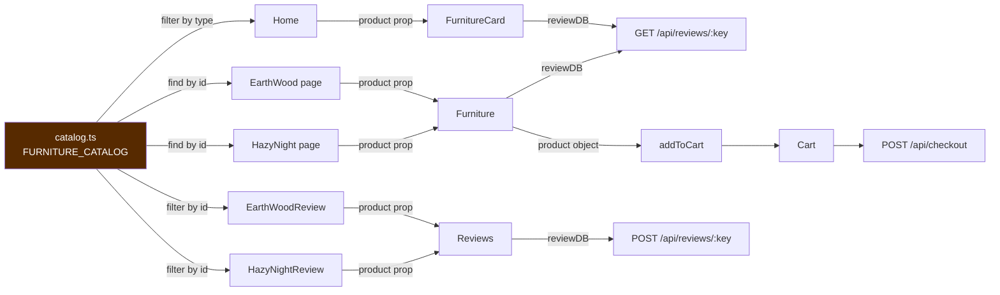

# 05 — Catalog Data Model

`src/utility/catalog.ts` — 62 lines that every product surface in the app depends on.

Related: [[03 - Component Network]] · [[07 - MongoDB and Mongoose]] · [[14 - Adding a New Product]]

---

## The `Product` interface

```ts
export interface Product {
    id: string;                      // 'earth-wood' — internal key
    type: string;                    // 'table' | 'nightstand' — grouping on Home
    route: string;                   // '/EarthWood' — detail page path
    review: string;                  // '/EarthWoodReview' — review form path
    reviewDB: string;                // 'earth-wood' — MongoDB join key
    name: string;                    // 'Earth Wood' — display name
    price: number;                   // 400 — dollars, not cents
    activeColor: string;             // '' — placeholder, overwritten in cart
    colors: Array<string>;           // display labels
    colorTextStyles: Array<string>;  // Tailwind text-* classes, index-aligned
    colorStyles: Array<string>;      // Tailwind bg-* classes, index-aligned
    stripePriceId: string;           // 'N/A' — unused
    image: string;                   // primary/thumbnail path
    imageGallery: Array<string>;     // front / side / top
    wood: string;                    // 'Poplar'
    width: string;                   // '36"' — strings, include the unit
    height: string;
    diameter: string;
}
```

## The data

```ts
export const FURNITURE_CATALOG: Product[] = [
    {
        id: 'earth-wood', type: 'table',
        route: '/EarthWood', review: '/EarthWoodReview', reviewDB: 'earth-wood',
        name: 'Earth Wood', price: 400, activeColor: '',
        colors:          ['raw wood',       'stain - espresso',  'stain - olive',  'stain - gray'],
        colorTextStyles: ['text-orange-200','text-espresso-500', 'text-olive-500', 'text-gray-500'],
        colorStyles:     ['bg-orange-200',  'bg-espresso-500',   'bg-olive-500',   'bg-gray-500'],
        stripePriceId: 'N/A',
        image: '/furniture/catalog/tables/earth-wood/earth-wood-front.png',
        imageGallery: [ /* front, side, top */ ],
        wood: 'Poplar', width: '36"', height: '25"', diameter: '14"'
    },
    { /* hazy-night — nightstand, $535, Poplar & Pine */ }
];
```

Two products today: **Earth Wood** ($400 table) and **Hazy Night** ($535 nightstand).

---

## Why this file is the hub



Five files read it, and the values flow outward into three different systems — the DOM, MongoDB, and Stripe.

## Access idioms

Three different lookup styles are used across the codebase for the same job:

```ts
// Home.tsx — group by category
FURNITURE_CATALOG.filter((item) => item.type === "table").map(...)

// EarthWood.tsx / HazyNight.tsx — single lookup with a guard
const item = FURNITURE_CATALOG.find((product) => product.id === 'earth-wood')
if (!item) return <p>Product not found</p>;

// EarthWoodReview.tsx — filter-then-map over one element
FURNITURE_CATALOG.filter((item) => item.id === 'earth-wood').map((item) => <Reviews ... />)
```

The `.filter().map()` form avoids the null check by rendering nothing on a miss. See [[12 - Coding Style Guide]].

---

## Design decisions worth understanding

### Parallel arrays for colours

`colors`, `colorTextStyles`, and `colorStyles` are three separate arrays joined only by array index:

```tsx
colors.map((item, index) => (
    <div className={`... ${colorTextStyles[index]} ${colorStyles[index]} ...`}>{item}</div>
))
```

Adding a colour means editing three arrays in lockstep, in both products. An array of objects (`{ label, textClass, bgClass }`) would make the grouping structural rather than positional. The trade taken was keeping the literal Tailwind class strings visible in the data file — which matters, because Tailwind must see complete class names in source to generate them.

### Tailwind classes stored as data

Storing `'bg-espresso-500'` in a data file couples the catalog to the styling layer, but it does keep the class scannable by Tailwind's compiler. The pattern breaks in `Cart.tsx`, which *constructs* one:

```tsx
className={`... ${item.activeColor === 'raw wood' ? 'bg-orange-200' : `bg-${item.activeColor}-500`}`}
```

`bg-${item.activeColor}-500` is never generated, because Tailwind scans text and cannot evaluate a template literal. See [[15 - Known Gotchas and Tech Debt]].

### `reviewDB` is the foreign key

`reviewDB: 'earth-wood'` matches `productIdentifier` in the Mongo `reviews` collection. Today it's identical to `id`, but the separate field means the database key can change without touching route or identity logic — the only piece of deliberate decoupling in the model.

### `price` is in dollars

Stored as `400`, converted at the boundary:

```js
unit_amount: Math.round(item.price * 100)   // backend/src/server.js
```

The `Math.round` guards against float artifacts (`4.35 * 100 === 434.99999...`). Correct, but the app is one decimal price away from needing care — see [[08 - Stripe Checkout Flow]].

### Vestigial fields

- **`stripePriceId: 'N/A'`** — the backend builds `price_data` inline and never reads this. It's a placeholder for a future migration to real Stripe Price objects.
- **`activeColor: ''`** — always empty in the catalog. It exists so the `Product` shape matches the cart-item shape produced by spreading `{ ...product, activeColor: finalColor }`. The catalog value is never read.

### Dimensions as strings

`width: '36"'` bundles value and unit. Fine for display (`<p>{product.width} - Width</p>`), but unusable for sorting or filtering without parsing.

## Asset path convention

```
public/furniture/catalog/<type-plural>/<product-id>/<product-id>-<view>.png
                         tables/       earth-wood/  earth-wood-front.png
```

Paths in the catalog are **absolute from `public/`** (leading `/`), so Vite serves them unhashed and the browser resolves them against the site root. This is what lets `Cart.tsx` turn them into absolute URLs for Stripe with `new URL(cleanPath, productionUrl)`.

Gallery order is **front → side → top** and `Furniture.tsx` indexes it positionally via `galleryPosition = [0, 1, 2]` and `galleryButton = [0, 1, 2]` — both hardcoded to three, so a fourth image would render but be unreachable by the dot controls.
