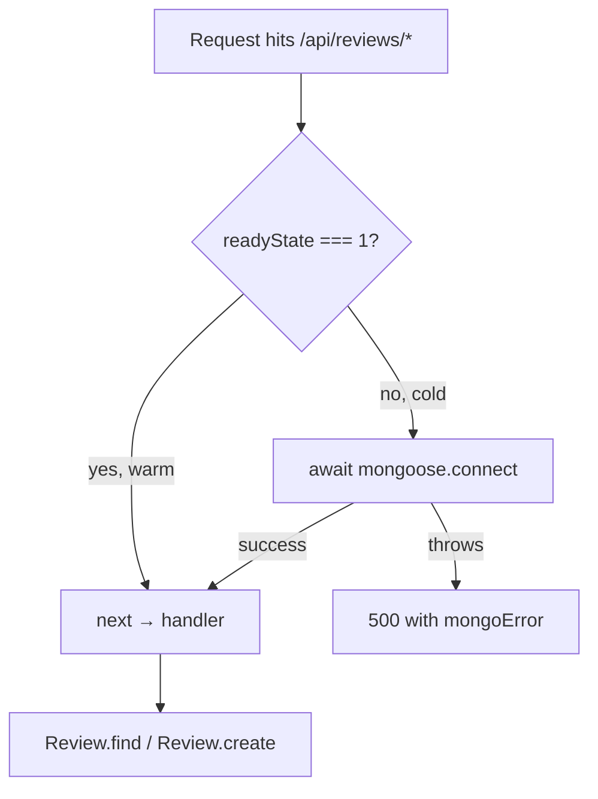

# 07 — MongoDB and Mongoose

The **M** in MERN. One collection, one schema, one connection pattern built for serverless.

Related: [[06 - Backend API]] · [[05 - Catalog Data Model]] · [[01 - Architecture and Data Flow]]

---

## Scope: reviews only

MongoDB stores **customer reviews and nothing else**. Products live in a hardcoded TypeScript array ([[05 - Catalog Data Model]]); orders live in Stripe; contact submissions go to Formspree. This keeps the database surface to a single collection.

## The schema

```js
const reviewSchema = new mongoose.Schema({
    title:             { type: String, required: true },
    rating:            { type: Number, required: true },
    comment:           { type: String, required: true },
    username:          { type: String, required: true },
    imageUpload:       { type: String, default: '' },
    videoUpload:       { type: String, default: '' },
    email:             { type: String, required: true },
    productIdentifier: { type: String, required: true },
    timestamp:         { type: Date, default: Date.now }
}, { collection: 'reviews' });
```

| Field | Notes |
|---|---|
| `title` | review headline |
| `rating` | 1–5 — **not enforced**; no `min`/`max` validator |
| `comment` | body text |
| `username` | public display name |
| `imageUpload` | Vercel Blob URL, `''` when absent |
| `videoUpload` | Vercel Blob URL, `''` when absent |
| `email` | collected but never displayed — see privacy note below |
| `productIdentifier` | join key, matches `product.reviewDB` |
| `timestamp` | `Date.now` — the function reference, correctly *not* called |

**Design choices to note:**

- `{ collection: 'reviews' }` pins the name explicitly, overriding Mongoose's automatic pluralisation. Predictable — the collection name can't drift if the model is ever renamed.
- `default: ''` rather than `null` for the media URLs. The frontend's rendering logic tests `review.imageUpload === ''`, so the sentinel is an empty string throughout the stack.
- `timestamp` instead of Mongoose's built-in `{ timestamps: true }` (which would give `createdAt`/`updatedAt`). A custom field for a custom name.
- **No index on `productIdentifier`**, despite it being the only field ever queried. At two products and low volume this is invisible; it's the first thing to add if the collection grows.

## The model — and why the `||`

```js
const ReviewCollection = mongoose.models.Review || mongoose.model('Review', reviewSchema);
```

Calling `mongoose.model('Review', ...)` twice with the same name throws `OverwriteModelError`. In a serverless environment the module can be re-evaluated across invocations while the Mongoose singleton persists in a warm container, so the guard checks the registry first. Standard defensive pattern for Next.js/Vercel-style deployments.

## The connection guard

```js
const connectDB = async (request, response, next) => {
    if (mongoose.connection.readyState === 1) {
        return next();
    }
    try {
        await mongoose.connect(process.env.MONGODB_URI);
        console.log("Connected to MongoDB Atlas");
        return next();
    } catch (error) {
        console.error("Database connection failed:", error);
        return response.status(500).json({
            success: false,
            error: "Database connection failed",
            mongoError: error.message
        });
    }
}
```

### Why connect inside a request

A traditional Express server connects once at boot. A serverless function has **no boot** — the container may be cold (no connection) or warm (connection alive from a previous request). Connecting at module scope would either race with the first request or leak connections across invocations.

`readyState === 1` means *connected*. The guard makes the connection **lazy and idempotent**: cold start pays the handshake, warm invocations skip straight through.

`readyState` values: `0` disconnected · `1` connected · `2` connecting · `3` disconnecting.



### One edge case

State `2` (*connecting*) falls through to `mongoose.connect()` again. Mongoose internally handles concurrent connect calls, so this is safe in practice — but a strict guard would be `readyState === 1 || readyState === 2`.

### It's a middleware, not a helper

Written as `(request, response, next)` so it composes into the route chain:

```js
app.post('/api/reviews/:productKey', connectDB, upload.fields([...]), handler);
app.get ('/api/reviews/:productKey', connectDB, handler);
app.post('/api/checkout', handler);          // no connectDB — Stripe needs no DB
```

Opt-in per route. `/api/checkout` never pays for a database handshake it doesn't use — a small but real cold-start saving.

## Queries in use

Exactly two, both trivial:

```js
// read
const reviews = await ReviewCollection.find({ productIdentifier: productKey });

// write
const newReview = await ReviewCollection.create({
    productIdentifier: productKey,
    title, rating, comment, username,
    imageUpload: resolvedImageUrl,
    videoUpload: resolvedVideoUrl,
    email
});
```

No aggregation, no `populate`, no transactions. Average rating is computed **client-side** in `FurnitureCard.tsx` via `Array.reduce` — which means the browser downloads every review document to display one number.

## Data flow across the boundary

```
catalog.ts               MongoDB document              Furniture.tsx
─────────────            ────────────────              ─────────────
reviewDB: 'earth-wood' → productIdentifier: 'earth-wood' → ReviewType[]
                         rating: 5                        '★'.repeat(5)
                         imageUpload: 'https://...blob'   
                         _id: ObjectId                    key={review._id}
```

The frontend redeclares the document shape as a local TypeScript interface — there's no shared type between client and server:

```ts
// Furniture.tsx
interface ReviewType {
    _id: string; title: string; rating: number; comment: string;
    username: string; imageUpload: string; videoUpload: string;
    email: string; timestamp: string;
}
```

`FurnitureCard.tsx` declares a **different, narrower** interface named `Review` with only the five fields it needs. Two hand-maintained mirrors of one schema; drift is possible in either direction.

## Privacy note

`GET /api/reviews/:productKey` returns whole documents, so **reviewer email addresses are sent to every visitor** who loads a product page — visible in the network tab even though nothing renders them. A `.select('-email')` projection would fix it without touching the frontend. Tracked in [[15 - Known Gotchas and Tech Debt]].
