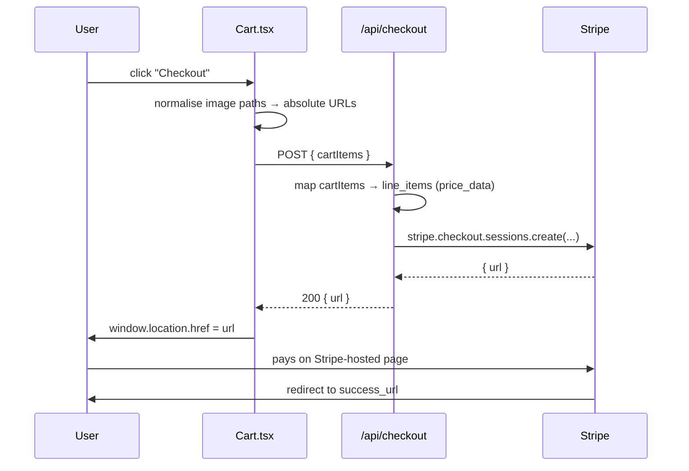

# 08 — Stripe Checkout Flow

Cart → server-built session → Stripe-hosted page. The app never touches card data.

Related: [[06 - Backend API]] · [[04 - State Management Patterns]] · [[05 - Catalog Data Model]]

---

## The model: hosted checkout

`@stripe/stripe-js` is listed in `package.json` but **never imported** anywhere in `src/`. There is no Stripe Elements form, no card input, no client-side Stripe SDK usage at all. The flow is:

1. Client POSTs the cart to its own backend
2. Backend calls the Stripe API with the secret key
3. Backend returns a `session.url`
4. Client does `window.location.href = url`

The secret key never leaves the server, and PCI scope stays with Stripe. This is the simplest correct integration.



---

## Client side — `Cart.tsx`

```js
const handleCheckout = async () => {
    try {
        const productionUrl = 'https://woodwork-creations.com/';
        const baseUrl = window.location.hostname === 'localhost' ? '' : productionUrl;

        const localCart = cart.map(item => {
            let absoluteImageUrl = '';

            if (item.image && !item.image.includes('...')) {
                if (item.image.startsWith('http')) {
                    absoluteImageUrl = item.image;
                } else {
                    const cleanPath = item.image.startsWith('/') ? item.image : `/${item.image}`;
                    absoluteImageUrl = new URL(cleanPath, productionUrl).href;
                }
                return { ...item, imageUrl: absoluteImageUrl };
            };
        });

        const response = await fetch(`${baseUrl}/api/checkout`, {
            method: 'POST',
            headers: { 'Content-Type': 'application/json' },
            body: JSON.stringify({ cartItems: localCart }),
        });

        const data = await response.json();

        if (data.url) {
            window.location.href = data.url;
        } else {
            console.error("Failed to retrieve a valid payment session URL.");
        }
    } catch (error) {
        console.error("Checkout redirection error:", error);
    }
}
```

### Why the image normalisation exists

The catalog stores **root-relative** paths (`/furniture/catalog/tables/earth-wood/earth-wood-front.png`). Stripe renders product thumbnails on *its own* domain, so a relative path is meaningless there — it must be a fully-qualified public URL. Hence:

```js
absoluteImageUrl = new URL(cleanPath, productionUrl).href;
// → https://woodwork-creations.com/furniture/catalog/tables/earth-wood/earth-wood-front.png
```

`new URL(path, base)` is the correct tool — it handles the slash joining without string concatenation bugs.

Note the base is **always** `productionUrl`, even when running locally. That's intentional: `http://localhost:5173/...` would be unreachable from Stripe's servers, so local testing points thumbnails at the live site's assets.

### Two fragile spots in this function

**The map can produce `undefined`.** The `return` sits *inside* the `if`. Any cart item failing the guard yields `undefined` in `localCart`, which serialises to `null` in JSON and crashes the server's `.map()` on `item.activeColor`. With the current catalog every item has a valid `image`, so the branch never fires — but it's an unguarded path.

**`!item.image.includes('...')`** tests for a literal three-dot substring. This looks like it was meant to catch the truncated-filename display convention used in the upload forms (`"my-very-long-file..."`), leaking a UI concern into checkout logic.

Both are tracked in [[15 - Known Gotchas and Tech Debt]].

---

## Server side — `POST /api/checkout`

```js
const { cartItems } = request.body;

const lineItems = cartItems.map((item) => {
    const formattedColor = item.activeColor
        ? `(${item.activeColor.charAt(0).toUpperCase() + item.activeColor.slice(1)})`
        : '';

    return {
        price_data: {
            currency: 'usd',
            product_data: {
                name: `${item.name} ${formattedColor}`,
                images: [item.imageUrl],
            },
            unit_amount: Math.round(item.price * 100),
        },
        quantity: item.quantity,
    };
});
```

**Colour capitalisation** happens here rather than in the database or the client: `espresso` → `(Espresso)`, producing a line item named `Earth Wood (Espresso)`. `raw wood` → `(Raw wood)` — only the first character is uppercased, so multi-word colours are sentence-case, not title-case.

**`unit_amount`** is cents. `Math.round(item.price * 100)` converts from the dollar value in [[05 - Catalog Data Model]] and absorbs float error.

### Session creation

```js
const origin = request.headers.origin || 'https://woodwork-creations.com/';

const session = await stripe.checkout.sessions.create({
    payment_method_types: ['card'],

    shipping_address_collection: { allowed_countries: ['US'] },

    shipping_options: [{
        shipping_rate_data: {
            type: 'fixed_amount',
            fixed_amount: { amount: 0, currency: 'usd' },
            display_name: 'Local Pickup'
        }
    }],

    line_items: lineItems,
    mode: 'payment',
    success_url: 'https://woodwork-creations.com/',
    cancel_url: 'https://woodwork-creations.com/'
});

return response.status(200).json({ url: session.url });
```

| Option | Value | Why |
|---|---|---|
| `payment_method_types` | `['card']` | cards only |
| `shipping_address_collection` | US only | matches the business's stated reach |
| `shipping_options` | $0 "Local Pickup" | the About page confirms local pickup only |
| `mode` | `'payment'` | one-time, not subscription |
| `success_url` / `cancel_url` | both the homepage | see below |

`const origin = request.headers.origin || ...` is computed and then **never used** — the URLs are hardcoded instead. Leftover from an earlier dynamic-redirect approach.

---

## Consequences worth knowing

### Prices are client-supplied

The server builds `unit_amount` from `item.price` in the request body. A crafted POST to `/api/checkout` can set any price, and Stripe will honour the session. Two standard fixes:

- Look up the price server-side by `item.id` against a server-owned catalog (the smallest change), or
- Use real Stripe Price objects and send `price: item.stripePriceId` instead of `price_data` — which is presumably what the unused `stripePriceId` field in the catalog was reserved for.

### Success and cancel are indistinguishable

Both redirect to `/`. The user gets no confirmation page, and the app has no way to tell a completed payment from an abandoned one.

### The cart is never cleared

After `window.location.href = url`, React state is destroyed by the navigation — but on return the user lands on a freshly-mounted app with an **empty** cart regardless of outcome, because cart state isn't persisted. So it self-clears by accident, and a *cancelled* checkout also loses the cart.

### No webhook, no order record

Nothing listens for `checkout.session.completed`. Orders exist only in the Stripe dashboard; the app has no record a purchase happened. Fulfilment is manual.

### No loading state

`handleCheckout` is `async` with no pending flag. The button is disabled only when the cart is empty (`disabled={cart.length === 0}`), so a slow network invites repeat clicks and duplicate sessions.

All of these are listed in [[15 - Known Gotchas and Tech Debt]].
