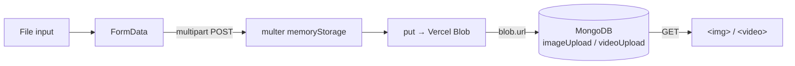

# 09 — Media Uploads

Customers attach a photo and/or video to a review. Files go to **Vercel Blob**; only the resulting URL goes to MongoDB.

Related: [[06 - Backend API]] · [[07 - MongoDB and Mongoose]] · [[03 - Component Network]]

---

## Why not store files in MongoDB

Documents are capped at 16 MB and binary payloads bloat every query that touches the collection. Storing a URL string instead keeps review documents tiny and lets the CDN serve the media. The schema reflects this — `imageUpload` and `videoUpload` are `String`.



---

## Client — `Reviews.tsx`

### Selecting a file

The `<input type="file">` is visually hidden and driven by its `<label>`, which is the accessible way to build a custom file button:

```tsx
<label htmlFor="imgUpload" className="text-sm font-semibold text-white bg-black min-w-27 p-2 hover:cursor-pointer">
    Upload Image
</label>
<input id="imgUpload" type="file" accept="image/*" onChange={handleImage} className="hidden" />
```

`accept="image/*"` / `accept="video/*"` filter the OS picker — a hint, not a guarantee.

### Two pieces of state per file

```tsx
const [imageUpload, setImageUpload]           = useState<string>('No file chosen');  // display
const [selectedImageFile, setSelectedImageFile] = useState<File | null>(null);       // payload
```

The handler splits them because the displayed name is truncated but the real `File` must stay intact:

```tsx
const handleImage = (event: React.ChangeEvent<HTMLInputElement>) => {
    const images = event.target.files;

    if (images && images.length > 0) {
        if (images[0].name.length > 20) {
            setImageUpload(images[0].name.substring(0, 21) + "...");
            setSelectedImageFile(images[0]);
        } else {
            setImageUpload(images[0].name);
            setSelectedImageFile(images[0]);
        }
    } else {
        setImageUpload('No file chosen');
        setSelectedImageFile(null);
    }
};
```

`handleVideo` is the same function with `video` substituted throughout. The string `'No file chosen'` acts as the sentinel for "empty" and drives the clear button's visibility:

```tsx
<button onClick={() => setImageUpload('No file chosen')} className={`${imageUpload === 'No file chosen' ? 'hidden' : 'block'} ...`}>
```

That clear button resets the **display name only** — `selectedImageFile` keeps its `File`, so a "cleared" file still uploads. Noted in [[15 - Known Gotchas and Tech Debt]].

### Submitting

```tsx
const formData = new FormData();

formData.append('title', title);
formData.append('rating', String(activeRating));
formData.append('comment', comment);
formData.append('username', username);
formData.append('email', email);

if (selectedImageFile) formData.append('image', selectedImageFile);
if (selectedVideoFile) formData.append('video', selectedVideoFile);

const response = await fetch(`/api/reviews/${product.reviewDB}`, {
    method: 'POST',
    body: formData,
});
```

Three details that matter:

1. **No `Content-Type` header.** Deliberate and required — the browser must set `multipart/form-data; boundary=...` itself. Setting it manually breaks the parse on the server.
2. **Files are appended conditionally**, so absent fields never reach multer.
3. **`String(activeRating)`** — `FormData` values are strings; Mongoose casts back to `Number` on the way into the schema.

The field names `'image'` and `'video'` must match the multer config exactly.

---

## Server — multer

```js
const upload = multer({
    storage: multer.memoryStorage(),
    limits: { fileSize: 50 * 1024 * 1024 }   // 50 MB
});
```

**`memoryStorage`** buffers the file in RAM rather than writing to disk. This is the correct choice for serverless — the filesystem is ephemeral and read-only in most paths, and the buffer is handed straight to Vercel Blob without ever touching disk. The cost is that the whole file occupies function memory during the request, which is what makes the 50 MB cap meaningful.

Mounted per-route with named fields:

```js
upload.fields([
    { name: 'image', maxCount: 1 },
    { name: 'video', maxCount: 1 }
])
```

`.fields()` (not `.single()` or `.array()`) because two differently-named fields can arrive in one request. The result lands on `request.files` as `{ image: [File], video: [File] }` — note each is an **array** even with `maxCount: 1`, hence the extraction:

```js
const imageFile = request.files && request.files['image'] ? request.files['image'][0] : null;
const videoFile = request.files && request.files['video'] ? request.files['video'][0] : null;
```

## Server — Vercel Blob

```js
if (imageFile) {
    const blob = await put(`reviews/${Date.now()}=${imageFile.originalname}`, imageFile.buffer, {
        access: 'public',
        contentType: imageFile.mimetype
    });
    resolvedImageUrl = blob.url;
}
```

- **Key**: `reviews/<timestamp>=<original filename>` — the `Date.now()` prefix prevents collisions when two customers upload `IMG_0001.jpg`. (The separator is `=` rather than the more conventional `-`; harmless in a blob key, just unusual.)
- **`access: 'public'`** — required, since the URL is embedded in an `` for anonymous visitors.
- **`contentType`** is forwarded from multer's detected mimetype so the browser renders rather than downloads.
- **Auth** is implicit: `@vercel/blob` reads `BLOB_READ_WRITE_TOKEN` from the environment.

Image and video are uploaded **sequentially** with two `await`s. `Promise.all` would halve the latency when both are present.

The URLs then go into the document:

```js
const newReview = await ReviewCollection.create({
    productIdentifier: productKey,
    title, rating, comment, username,
    imageUpload: resolvedImageUrl,   // '' if no file
    videoUpload: resolvedVideoUrl,
    email
});
```

`resolvedImageUrl` starts as `''`, so the "no file" case naturally matches the schema's `default: ''`.

---

## Rendering — `Furniture.tsx`

A three-level nested ternary covers all four combinations:

```tsx
review.imageUpload === '' && review.videoUpload === '' ? (
    <div className="hidden"></div>
) : review.imageUpload !== '' && review.videoUpload !== '' ? (
    <div>
        
        <video src={review.videoUpload} controls className="max-w-100" />
    </div>
) : review.imageUpload ? (
    
) : (
    <video src={review.videoUpload} controls className="w-100" />
)
```

Reads as: neither → nothing · both → stacked · image only → image · otherwise → video.

Note the mixed test styles — `=== ''` in the first two branches, truthiness in the third. Equivalent here, since `''` is the only falsy value the schema can produce.

`<video>` gets `controls` and no `autoPlay`, so nothing plays unbidden.

---

## Gaps

- **No client-side size check.** A 60 MB video is fully uploaded before multer rejects it, and multer's `LIMIT_FILE_SIZE` error surfaces as a generic `500`.
- **No upload progress.** `fetch` gives no progress events; the toast fires immediately on submit regardless of how long the upload takes.
- **The toast is optimistic.** `setMessageVisibility('block')` runs at the *top* of `handleSubmit`, before the request — so "Submitted" appears even if the POST later fails.
- **No blob cleanup.** If `ReviewCollection.create` throws after a successful upload, the blob is orphaned with no document referencing it.
- **Content is unmoderated.** Any visitor can upload arbitrary public media, and there is no auth or rate limit ([[06 - Backend API]]).

See [[15 - Known Gotchas and Tech Debt]].
