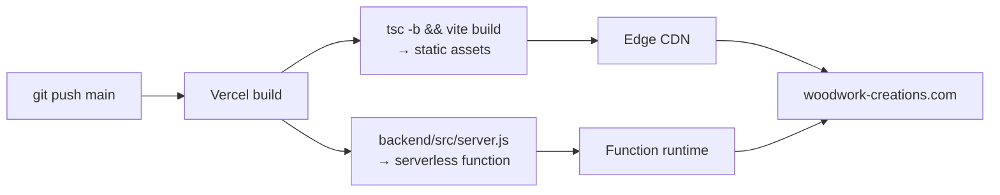

# 13 — Deployment and Configuration

Every config file in the repo and what it controls.

Related: [[01 - Architecture and Data Flow]] · [[06 - Backend API]] · [[10 - Tailwind Design System]]

---

## `package.json` (root — frontend)

```json
"scripts": {
  "dev":     "vite",
  "build":   "tsc -b && vite build",
  "lint":    "eslint .",
  "preview": "vite preview"
}
```

`build` runs **`tsc -b` first** — a type error fails the build before Vite ever runs. Vite itself strips types without checking them, so this is the only place type safety is enforced.

```bash
npm run dev
```

### Runtime dependencies

| Package | Role |
|---|---|
| `react` / `react-dom` 19 | UI runtime |
| `react-router-dom` 7 | client-side routing |
| `tailwindcss` + `@tailwindcss/vite` 4 | styling ([[10 - Tailwind Design System]]) |
| `react-aria-components` | accessible modals ([[03 - Component Network]]) |
| `@vercel/analytics` | page-view telemetry |
| `@vercel/speed-insights` | Core Web Vitals |
| `@stripe/stripe-js` | **installed but never imported** — see [[08 - Stripe Checkout Flow]] |

`"type": "module"` — ESM everywhere, including config files.

## `backend/package.json`

A **separate** manifest with its own dependency tree and no scripts:

```json
{
  "name": "backend", "type": "module", "main": "src/server.js",
  "dependencies": {
    "@vercel/blob": "^2.6.1", "cors": "^2.8.5", "express": "^4.19.2",
    "mongoose": "^8.0.0", "multer": "^2.2.0", "stripe": "^22.3.1"
  }
}
```

Not an npm workspace — just a nested package that Vercel's `@vercel/node` builder installs independently. Server dependencies never reach the browser bundle, and `stripe` (which holds the secret key) can't be imported from frontend code by accident.

## `vite.config.ts`

```ts
export default defineConfig({
  plugins: [ react(), tailwindcss() ]
})
```

Two plugins, nothing else. No aliases, no proxy, no build tuning.

> **Local development note:** there's no `server.proxy` entry, so `fetch('/api/...')` from the Vite dev server on `:5173` hits Vite, not the Express server on `:8080` — the rewrites in `vercel.json` only apply on Vercel. Local full-stack work needs either `vercel dev` or a proxy block added here. See [[15 - Known Gotchas and Tech Debt]].

## `vercel.json`

```json
{
  "version": 2,
  "builds": [
    { "src": "package.json",          "use": "@vercel/static-build" },
    { "src": "backend/src/server.js", "use": "@vercel/node" }
  ],
  "rewrites": [
    { "source": "/api/checkout",            "destination": "/backend/src/server.js" },
    { "source": "/api/reviews",             "destination": "/backend/src/server.js" },
    { "source": "/api/reviews/:productKey", "destination": "/backend/src/server.js" },
    { "source": "/((?!api/).*)",            "destination": "/index.html" }
  ]
}
```

Two builds from one repo, plus routing. The last rewrite is the SPA fallback — a negative lookahead sending everything except `api/*` to `index.html` so React Router can handle deep links on refresh. Full explanation in [[01 - Architecture and Data Flow]].

Note the `/api/reviews` rewrite has no matching Express handler.

## TypeScript configs

Three files, project-references style:

```jsonc
// tsconfig.json — solution file only
{ "files": [], "references": [ { "path": "./tsconfig.app.json" }, { "path": "./tsconfig.node.json" } ] }
```

- **`tsconfig.app.json`** — `include: ["src"]`, DOM libs, `jsx: react-jsx`, bundler resolution
- **`tsconfig.node.json`** — for `vite.config.ts` itself, Node globals

Splitting them means browser code can't accidentally use Node types and vice versa. Key `app` flags:

| Flag | Effect |
|---|---|
| `noUnusedLocals` / `noUnusedParameters` | dead variables fail the build |
| `erasableSyntaxOnly` | no `enum`, no parameter properties — types must erase cleanly |
| `verbatimModuleSyntax` | type imports must say `type` |
| `noEmit` | Vite emits; `tsc` only checks |
| `moduleDetection: force` | every file is a module |
| `skipLibCheck` | don't type-check `node_modules` |

**`backend/src/server.js` is plain JavaScript** and is not covered by any tsconfig — no type checking on the server at all.

## `eslint.config.js`

Flat config with four preset layers: `js.recommended`, `tseslint.recommended`, `reactHooks.flat.recommended`, `reactRefresh.vite`. `dist` is globally ignored. Covered in [[12 - Coding Style Guide]].

## `index.html`

```html
<html lang="en" class="scroll-smooth">
```

`scroll-smooth` on the root element is what animates the hero's `<a href="#furniture-menu">` jump on the home page.

SEO/meta:

```html
<meta name="description" content="A family owned carpentry business that leads with genuine hand craftsmanship." />
<meta name="keywords" content="WoodWork Creations, Carpentry, Craftmanship, Furniture" />
<meta name="author" content="Joshua M." />
<meta name="google-site-verification" content="..." />
<link rel="icon" type="image/svg+xml" href="/favicon.svg" />
<title>WoodWork Creations</title>
```

Because the app is a client-rendered SPA, **every route shares this one title and description**. There's no per-page meta and no Open Graph tags, so link previews are identical everywhere. See [[15 - Known Gotchas and Tech Debt]].

`public/hammer-favicon.svg` exists but `favicon.svg` is the one referenced.

`favicon.svg` is hand-written rather than downloaded — a 32×32 `bark-950` tile with a `bone-50` monogram over a baseline rule, drawn as one stroked path and one rect:

```svg
<svg xmlns="http://www.w3.org/2000/svg" viewBox="0 0 32 32" role="img" aria-label="WoodWork Creations">
    <rect width="32" height="32" fill="#16110E"/>
    <path d="M5 7 L10.5 22 L16 12 L21.5 22 L27 7" fill="none" stroke="#F7F4EE"
          stroke-width="4.5" stroke-linejoin="miter" stroke-linecap="butt" stroke-miterlimit="10"/>
    <rect x="5" y="25.5" width="22" height="1.5" fill="#F7F4EE"/>
</svg>
```

It repeats the header exactly — dark bar, light wordmark, squared, with a hairline underneath — so the browser tab reads as part of the same system. The colours are the literal hex values of `--color-bark-950` and `--color-bone-50`; an SVG in `public/` is served verbatim and never passes through Tailwind, so the tokens cannot be referenced by name. **If those two tokens change, this file has to be edited by hand.**

`stroke-linejoin="miter"` is what keeps the joins sharp at 16px; rounded joins turn the monogram to mush at tab size.

## Environment variables

Set in the Vercel dashboard; mirrored locally in `backend/.env.local` (generated by `vercel env pull`).

| Variable | Consumer |
|---|---|
| `MONGODB_URI` | `connectDB` |
| `STRIPE_SECRET_KEY` | `new Stripe(...)` at module load |
| `BLOB_READ_WRITE_TOKEN` | `@vercel/blob` |
| `BLOB_STORE_ID` | Vercel Blob |
| `NODE_ENV` | `app.listen` guard |

`.gitignore` covers `.env*` and `.vercel`, so nothing sensitive is tracked. No frontend env vars exist — the frontend holds no keys, which is a direct consequence of the hosted-checkout design in [[08 - Stripe Checkout Flow]].

## Static assets

```
public/
├── favicon.svg                               ← hand-written, see above
├── hammer-favicon.svg                        ← superseded, not referenced
├── faq-plus-icon.svg, faq-minus-icon.svg     ← swapped by About.tsx
├── heroSectionImage.avif                     ← home hero
├── about-media/
│   ├── workStation1-4.png                    ← About gallery, and the dark
│   │                                            bands on Home, Gallery, About
│   ├── woodWorkSample.mp4, woodworkPoster.webp   ← not referenced in src/
└── furniture/
    ├── catalog/<type>/<product>/<product>-{front,side,top}.png
    └── gallery/img1-6.avif                        ← home collections strip
```

Everything in `public/` is served verbatim at the site root with no hashing, which is what lets `catalog.ts` store stable paths like `/furniture/catalog/tables/earth-wood/earth-wood-front.png` and `Cart.tsx` turn them into absolute URLs for Stripe.

Format choices are deliberate: **AVIF** for photographic content (hero, gallery), **PNG** for product shots needing transparency, **SVG** for icons, **WebP** as the video poster.

The `workStation*.png` files now do double duty: the About page's studio grid shows them straight, and three sections across Home, Gallery, and About use them as dimmed backgrounds behind dark bands (`opacity-20` to `opacity-35` over `bg-bark-950`).

`furniture/gallery/img1-6.avif` is stock photography, used by the home collections strip and **labelled as such on the page** — it depicts no product in the catalog. Still unreferenced: `about-media/woodWorkSample.mp4` and its `woodworkPoster.webp`, staged for the Behind-the-Scenes section that remains "Coming Soon".

## Third-party services

| Service | Purpose | Configured in |
|---|---|---|
| Vercel | hosting, serverless functions, Blob storage | `vercel.json` |
| MongoDB Atlas | review persistence | `MONGODB_URI` |
| Stripe | payments | `STRIPE_SECRET_KEY` |
| Formspree | contact form (`f/meebeyjw`) | hardcoded in `Contact.tsx` |
| Google Fonts | Archivo (`wdth` + `wght` axes), Inter | `@import` in `App.css` |

Note that the contact form bypasses the backend entirely — it POSTs straight to Formspree from the browser. The form's image upload input is collected in local state but **never sent**, since the payload is JSON with only `name`, `email`, `phone`, and `message`.

## Deploy flow



Push to `main` deploys. No CI, no tests, no preview gates — `tsc -b` is the only automated check between a commit and production.
